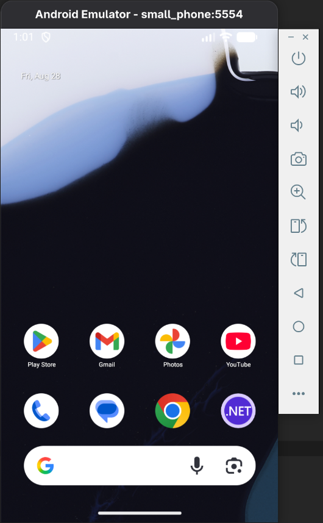
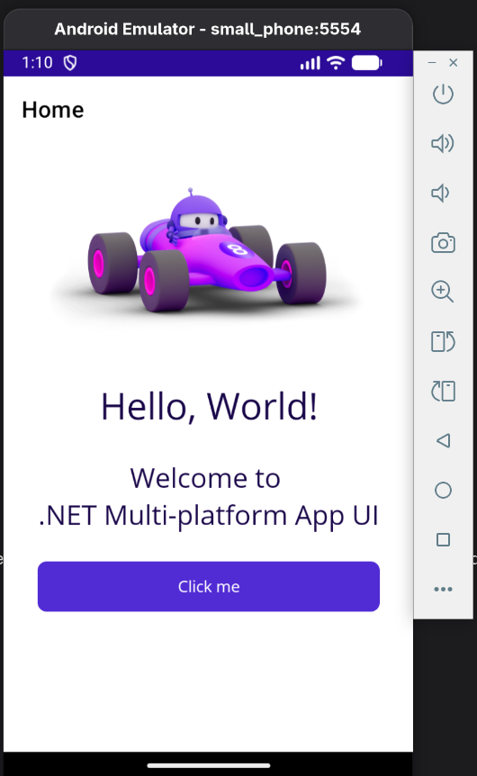
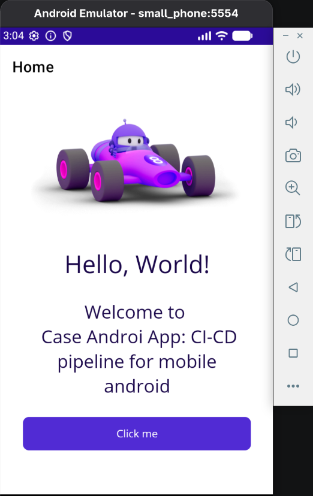

# maui-dotnet-mobile-app

## install

- install [dotnet on linux](https://github.com/owenwilson/dotnet-sdk-manager)

```sh
sudo dnf install -y dotnet-sdk-8.0
```

- install maui-android

```sh
dotnet workload install maui-android
```

- install [java17](https://github.com/owenwilson/sdk_java_manager)

```sh
sudo dnf install -y java-17-openjdk-devel
```

## setup proyect

- create folder

```sh
mkdir maui-dotnet-mobile-app && cd maui-dotnet-mobile-app
```

- create globaljson file with the version .net 8

```sh
dotnet new globaljson --sdk-version 8.0.424
```

- install maui template

```sh
dotnet new install Microsoft.Maui.Templates
```

- verify maui templat

```sh
dotnet new --list | grep maui
.NET MAUI App (Preview)                        maui                        [C#]        MAUI/Android/iOS/macOS/Mac Catalyst/Windows/Tizen
.NET MAUI Blazor App (Preview)                 maui-blazor                 [C#]        MAUI/Android/iOS/macOS/Mac Catalyst/Windows/Tizen/Blazor
.NET MAUI Class Library (Preview)              mauilib                     [C#]        MAUI/Android/iOS/macOS/Mac Catalyst/Windows/Tizen
.NET MAUI ContentPage (C#) (Preview)           maui-page-csharp            [C#]        MAUI/Android/iOS/macOS/Mac Catalyst/WinUI/Tizen/Xaml/Code
.NET MAUI ContentPage (XAML) (Preview)         maui-page-xaml              [C#]        MAUI/Android/iOS/macOS/Mac Catalyst/WinUI/Tizen/Xaml/Code
.NET MAUI ContentView (C#) (Preview)           maui-view-csharp            [C#]        MAUI/Android/iOS/macOS/Mac Catalyst/WinUI/Tizen/Xaml/Code
.NET MAUI ContentView (XAML) (Preview)         maui-view-xaml              [C#]        MAUI/Android/iOS/macOS/Mac Catalyst/WinUI/Tizen/Xaml/Code
.NET MAUI ResourceDictionary (XAML) (Preview)  maui-dict-xaml              [C#]        MAUI/Android/iOS/macOS/Mac Catalyst/WinUI/Xaml/Code
```

- create proyect

```sh
dotnet new maui -n maui-mobile-app
```

## run proyecto android

- check out [android sdk for linux](https://github.com/owenwilson/android-sdk-for-linux)
- install sdk "platforms;android-34"

```sh
sdkmanager "platforms;android-34"
```

- start android emulator

```sh
android emulator start small_phone
```



- check devices

```sh
adb devices
```

```sh
List of devices attached
emulator-5554	device
```

- run dotnet command for android linux

```sh
dotnet build -t:Run -f net8.0-android
```



- stop android emulator

```sh
android emulator stop small_phone
```

- compile proyect

```sh
dotnet build -f net8.0-android
```

- publish release

```sh
dotnet publish -f net8.0-android -c Release
```

## publish and generate apk

- example signing - generating a keystore file
- example pass: Sample@!2

```sh
keytool -genkeypair -v -keystore maui-dotnet-mobile-app.keystore -alias maui-dotnet-mobile-app -keyalg RSA -keysize 2048 -validity 100000
```

- verify your keystore password

```sh
keytool -list -keystore maui-dotnet-mobile-app.keystore
```

- install additional workloads

```sh
dotnet workload list
```

```sh
dotnet workload install android
```

- install optional (use these dependencies when you need IOS)

```sh
dotnet workload install maccatalyst
dotnet workload install ios
dotnet workload install maui
```

- run android emulator

```sh
android emulator start small_phone
```

- download the apk from the azure devops artifacts
- drag and drop the downloaded apk file into the android emulator



- stop android emulator

```sh
android emulator stop small_phone
```

## uninstall

```sh
dotnet workload uninstall maui-android
```

- clean temporal files

```sh
dotnet workload clean
```

## references

- check out [net maui on linux](https://techcommunity.microsoft.com/blog/educatordeveloperblog/-net-maui-on-linux-with-visual-studio-code/3982195)
- check out [install dotnet sdk manager for linux](https://github.com/owenwilson/dotnet-sdk-manager)
- check out [install android sdk](https://github.com/owenwilson/android-sdk-for-linux)
- check out [install sdk java manager for linxu](https://github.com/owenwilson/sdk_java_manager)
- check out [dotnet maui deployment app](https://learn.microsoft.com/en-us/dotnet/maui/deployment/?view=net-maui-9.0)
